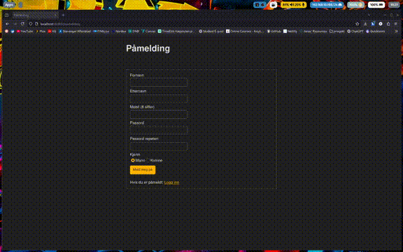

# Arbeidskrav 4 i emnet DAT108 på HVL

Dette er en besvarelse på et arbeidskrav som omhandler MVC modellen i et Spring Boot prosjekt. Målet er å bygge en nettside hvor du kan melde deg på en liste. Du skal da få en kvittering som bekreftelse når du har meldt deg på. Videre skal du kunne se en liste over alle som er påmeldt. Det skal også være mulig å logge inn senere med det registrerte mobil nummeret og passordet for å se listen over deltagere uten å registrere på nytt.

Arbeidskravet er delt inn i to deler. Del 1 går mest ut på å lage siden og dens funksjonalitet. Del 2 implementerer mer sesjon håndtering, hvordan behandle passord med hash og koble applikasjonen opp mot en database. Siden oppgaven her ligger offentlig har jeg valgt å kun knytte den til en lokal database.

Oppgavebeskrivelsene ligger her: [Del 1](./Oppgavebeskrivelse-del1.pdf) [Del 2](./Oppgavebeskrivelse-del2.pdf)

## Showcase

